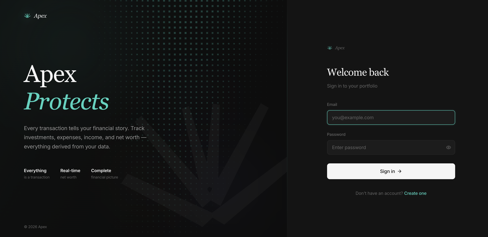
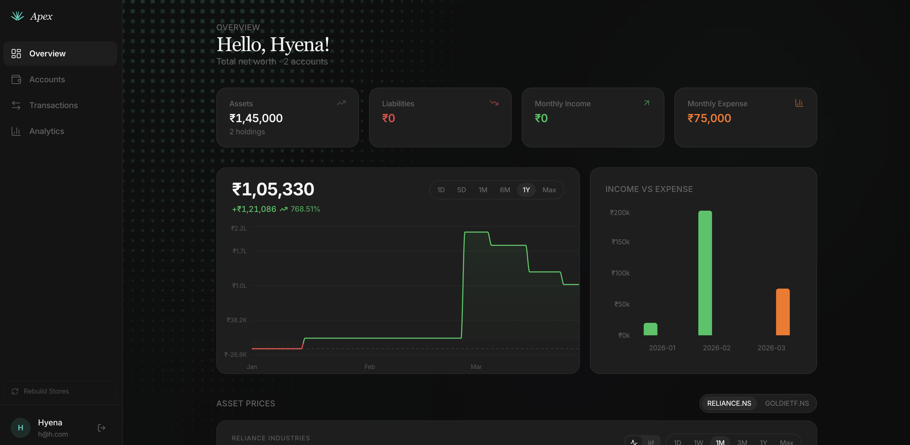
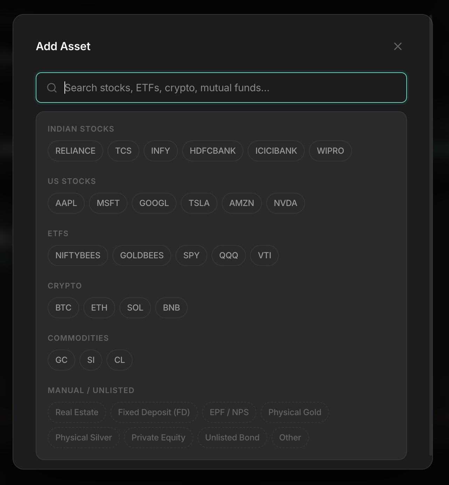
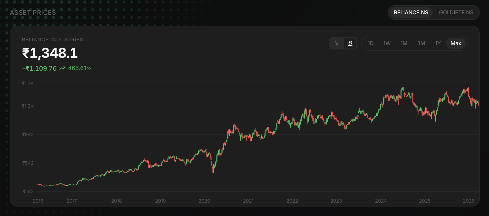

<div align="center">
  

  <h1>Apex</h1>
  <p><strong>A premium portfolio tracking experience.</strong><br/>Every transaction tells your financial story.</p>

  <p>
    
    
    
    
    
  </p>
</div>

---

## Overview

Apex is a non-traditional, premium portfolio tracking web application built around a single philosophy: **everything is a transaction**. Income, expenses, asset purchases and sales, transfers — all are recorded as transactions, and every balance, holding, and analytics view is computed from them in real-time.

There are no manual balance fields to keep in sync. Your complete financial picture — net worth, investments, liabilities, income, expenses — emerges naturally from your transaction history.

---

## Screenshots

### Sign In



A clean, dark split-screen auth experience. *"Apex Protects"* — every transaction is yours, isolated by JWT-authenticated accounts, zero data leakage between users.

---

### Dashboard



Your full financial picture at a glance. The dashboard surfaces net worth, total assets, liabilities, monthly income and expense in stat cards, then goes deeper with a live net-worth line graph, an income-vs-expense bar chart, and live asset price charts for every holding you own — all in one view.

---

### Add Asset



Search across stocks, ETFs, crypto, mutual funds, and commodities with live Yahoo Finance results. Popular symbols are surfaced up front, grouped by category — Indian stocks, US stocks, ETFs, crypto, commodities — so you rarely need to type. Select a symbol, enter the date and quantity, and the historical purchase price is filled in automatically. Manual and unlisted assets (real estate, FDs, EPF/NPS, physical gold, private equity) are also fully supported.

<br clear="right"/>

---

### Asset Prices — Candlestick & Line Charts



Every holding gets a live price chart powered by Yahoo Finance. Switch between a smooth area/line view and full OHLC candlestick charts. Time ranges from intraday (1D with hourly bars) through to Max — which scales automatically to show yearly labels over a decade of history. The green/red gradient on the line chart is anchored to the period's opening price, not an arbitrary baseline.

---

## Features

| Category | Details |
|---|---|
| **Portfolio** | Net worth tracking, holdings by account, asset allocation breakdown |
| **Real-time Prices** | Yahoo Finance integration — live prices, historical OHLC, candlestick charts |
| **Charts** | Net worth history, income vs expense, asset allocation pie, asset price line + candlestick |
| **Transactions** | Income, expense, transfer, adjustment, buy, sell — all typed and categorised |
| **Accounts** | Bank, brokerage, retirement, debt, wallet — each with its own balance and holdings history |
| **Assets** | Stocks, ETFs, bonds, mutual funds, crypto, gold, commodities, EPF/NPS, FDs, real estate, private equity |
| **Analytics** | Expense breakdown by category, income/expense trends, portfolio holdings donut |
| **Auth** | JWT authentication, bcrypt-hashed passwords, per-user data isolation |

---

## Architecture

### Philosophy

> **Everything is a transaction.** Balances are never stored — they are always derived from the transaction ledger via MongoDB aggregation pipelines. Holdings are computed from buy/sell transactions using AVCO (Average Cost) costing. Net worth history is maintained as a pre-computed daily series updated incrementally on every write.

### Stack

| Layer | Technology |
|---|---|
| **Frontend** | React 19, Vite, React Router 7, Tailwind CSS 4, Recharts 3, Radix UI, Lucide |
| **Backend** | Node.js, Express 4, Mongoose 8, MongoDB |
| **Auth** | JWT (`jsonwebtoken`), bcryptjs, Helmet |
| **Market Data** | Yahoo Finance (via server-side proxy) |
| **Deployment** | Vercel (client), Render (server) |
| **Dev DB** | `mongodb-memory-server` auto-fallback when no `MONGODB_URI` is set |

### Data Model

Three primary collections: `users`, `accounts`, `transactions`.

```
User
 └─ Account (bank | brokerage | retirement | debt | wallet | other)
     └─ Transaction (income | expense | transfer | adjustment | buy | sell)
```

- **Account balance** = sum of cash-affecting transactions (income, expense, transfer, deposit, withdrawal, adjustment, buy, sell)
- **Holdings** = aggregated from `buy`/`sell` transactions per symbol, AVCO cost basis
- **Net worth** = Σ(asset account balances + holdings market value) − Σ(debt account balances)

### Key Backend Patterns

- MongoDB aggregation pipelines for balance calculation, holdings, net worth history, and analytics
- `AccountHoldings` pre-computed store updated incrementally on every buy/sell (full rebuild on historical edits)
- `DailyNetWorth` and `DailyAccountBalance` stores updated on every transaction write for O(1) history queries
- Account deletion cascades to all transactions
- All queries scoped to `req.user._id` — no cross-user data access possible

---

## Getting Started

### Prerequisites

- Node.js 18+
- MongoDB (optional — falls back to in-memory MongoDB automatically)

### 1. Clone

```bash
git clone <repo-url>
cd Apex
```

### 2. Server setup

```bash
cd server
cp .env.example .env   # or create .env manually (see below)
npm install
npm run dev            # starts on http://localhost:5000
```

**`server/.env`**

```env
MONGODB_URI=mongodb://localhost:27017/apex   # omit to use in-memory DB
JWT_SECRET=your-secret-key-here
JWT_EXPIRE=30d
NODE_ENV=development
```

> If `MONGODB_URI` is not set, the server starts with an in-memory MongoDB instance automatically — no setup required for local development.

### 3. Client setup

```bash
cd client
cp .env.example .env   # or create .env manually
npm install
npm run dev            # starts on http://localhost:5173
```

**`client/.env`**

```env
VITE_API_URL=http://localhost:5000/api
```

### 4. Open the app

Visit [http://localhost:5173](http://localhost:5173), create an account, and start tracking.

---

## API Reference

### Auth
| Method | Endpoint | Description |
|---|---|---|
| `POST` | `/api/auth/register` | Create account |
| `POST` | `/api/auth/login` | Sign in, receive JWT |
| `GET` | `/api/auth/me` | Current user |

### Accounts
| Method | Endpoint | Description |
|---|---|---|
| `GET` | `/api/accounts` | List all accounts |
| `POST` | `/api/accounts` | Create account |
| `GET` | `/api/accounts/:id` | Account detail + holdings |
| `PUT` | `/api/accounts/:id` | Update account |
| `DELETE` | `/api/accounts/:id` | Delete account + transactions |
| `GET` | `/api/accounts/:id/holdings` | Holdings for account |
| `GET` | `/api/accounts/:id/daily` | Daily cash balance history |

### Transactions
| Method | Endpoint | Description |
|---|---|---|
| `GET` | `/api/transactions` | List (filterable by account, type, date, category) |
| `POST` | `/api/transactions` | Create transaction |
| `PUT` | `/api/transactions/:id` | Update transaction |
| `DELETE` | `/api/transactions/:id` | Delete transaction |

### Dashboard
| Method | Endpoint | Description |
|---|---|---|
| `GET` | `/api/dashboard/summary` | Net worth, assets, liabilities, monthly flows, recent transactions |
| `GET` | `/api/dashboard/holdings` | All holdings across accounts |
| `GET` | `/api/dashboard/asset-allocation` | Holdings grouped by asset type |
| `GET` | `/api/dashboard/income-expense` | Monthly income/expense for N months |
| `GET` | `/api/dashboard/expense-categories` | Expense breakdown by category |

### Market Data
| Method | Endpoint | Description |
|---|---|---|
| `GET` | `/api/market/search?q=` | Symbol search (Yahoo Finance) |
| `GET` | `/api/market/price?symbol=&date=` | Historical close price for a date |
| `GET` | `/api/market/ohlc?symbol=&days=` | OHLC candle data (auto-selects 1h/1d/1wk interval) |

---

## Transaction Types

| Type | Effect |
|---|---|
| `income` | +cash |
| `expense` | −cash |
| `transfer` | −cash source account, +cash destination account |
| `adjustment` | ±cash (set balance to exact amount) |
| `buy` | −cash, +asset holding (book value unchanged) |
| `sell` | +cash, −asset holding (book value unchanged) |

---

## Project Structure

```
Apex/
├── client/                  # React + Vite frontend
│   └── src/
│       ├── components/
│       │   ├── charts/      # PriceGrapher, HoldingsDonut, AssetPricePanel, ChartTooltip
│       │   ├── forms/       # TransactionForm
│       │   ├── market/      # MarketSearch, AssetTransactionForm
│       │   ├── layout/      # AppShell
│       │   └── ui/          # Modal, ConfirmModal
│       ├── context/         # AuthContext
│       ├── lib/             # api.js (Axios client), utils.js
│       └── pages/           # Dashboard, Analytics, Accounts, AccountDetail, Transactions
│
└── server/                  # Express backend
    ├── config/              # MongoDB connection
    ├── middleware/           # JWT auth
    ├── models/              # User, Account, Transaction, AccountHoldings, DailyNetWorth
    ├── routes/              # auth, accounts, transactions, dashboard, market, networth
    ├── services/            # holdingsService, dailyValueService
    └── utils/               # balance helpers
```

---

<div align="center">
  <br/>
  <sub>Apex — Your complete financial picture.</sub>
</div>
