<div align="center">
  

  <h1>Apex</h1>
  <p><strong>A premium portfolio tracker.</strong><br/>Every transaction tells your financial story.</p>

  <p>
    
    
    
    
    
  </p>
</div>

---

Apex tracks your whole financial picture in one place: bank accounts, investments, loans, income and spending. It is built on one idea, **everything is a transaction**. You record what happened, and every balance, holding, chart and net-worth figure is worked out from those transactions.

> The project is in active development.

## A look inside

### Your whole picture, in one figure
Net worth with its 1D/1W/1M/1Y moves, and exactly what it is made of.

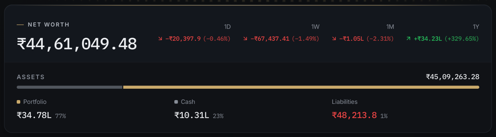

### Measure yourself against anything
Every line rebased to the same start, labelled with its return where it ends. Global indices come in dollars **and in rupees**, so you see what the S&P 500 actually earned an Indian investor (+23.4%) and not just what it did in America (+14.2%).

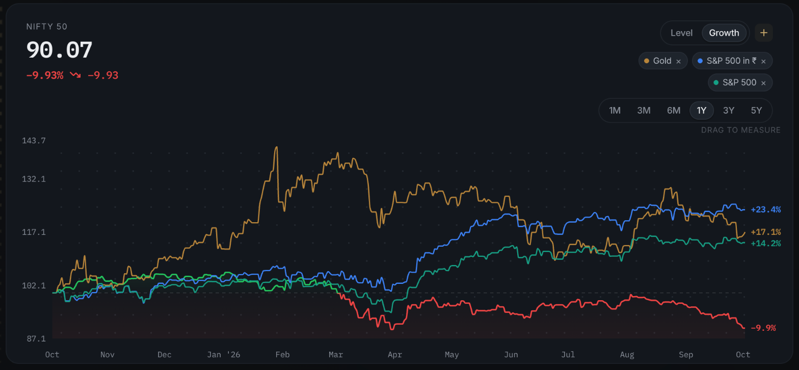

<table>
  <tr>
    <td width="42%">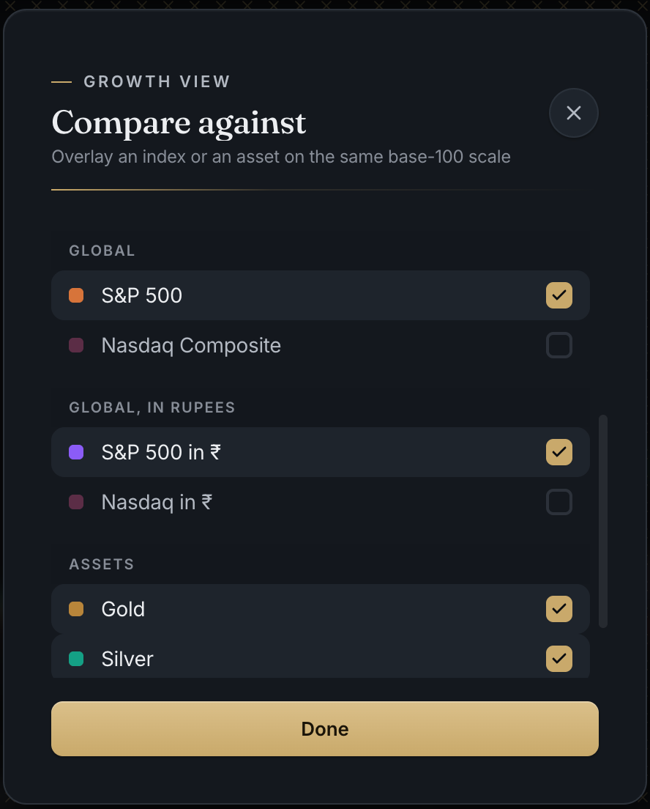</td>
    <td width="58%">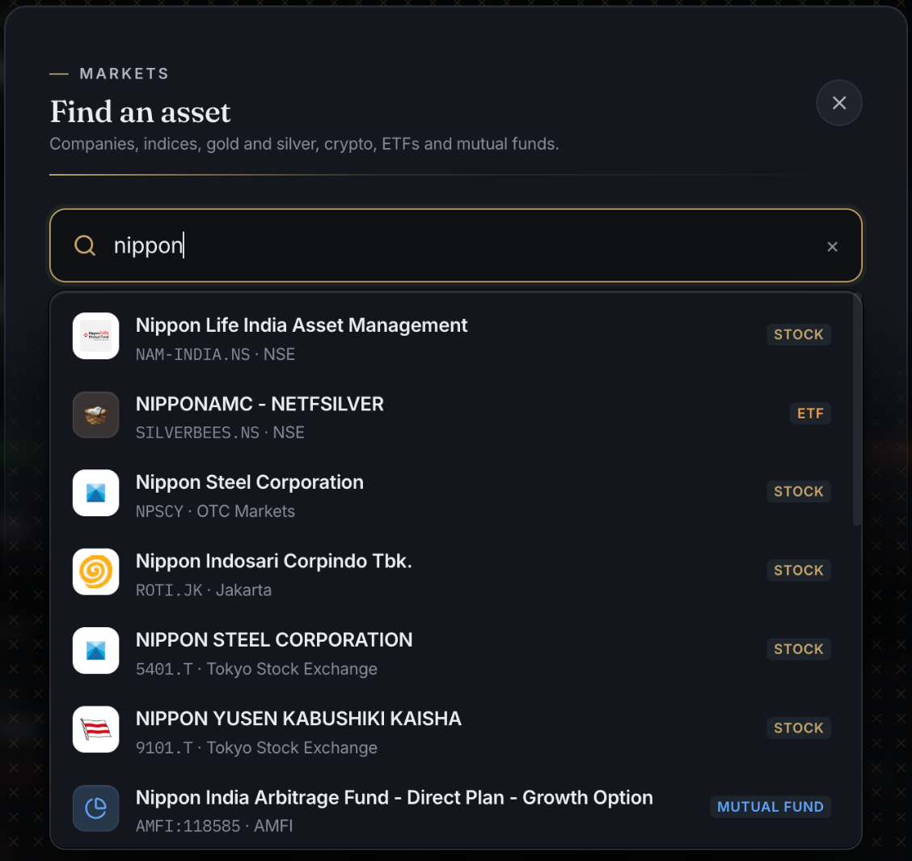</td>
  </tr>
  <tr>
    <td><sub>Indian indices, global markets (in $ or ₹), gold, silver, bitcoin and the dollar.</sub></td>
    <td><sub>One search for stocks, ETFs, mutual funds, crypto and metals, worldwide.</sub></td>
  </tr>
</table>

### What actually made the money
Each holding's share of your return, in percentage points, adding up to the total. A 90% gain on a tiny position ranks below a 12% gain on half the book, because that is what it did for you.

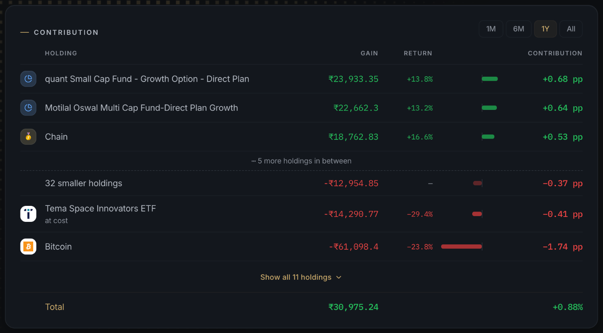

### The mix you have, not the one you chose
Allocation at market value, with what each asset class cost, what it is worth now, and how far it has drifted.

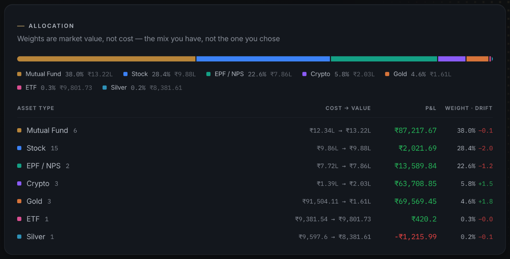

### Where the money comes and goes
Income, spending and net cashflow on one axis, then every month as a line of the ledger.

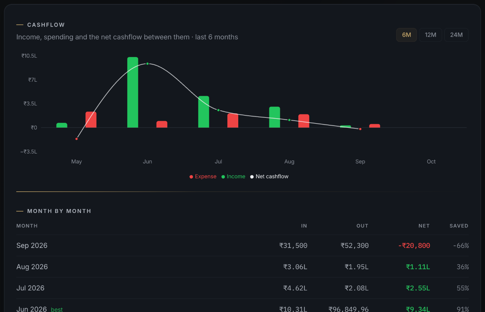

### Every account, ranked
Each account's balance, its share of the total and its last 90 days.

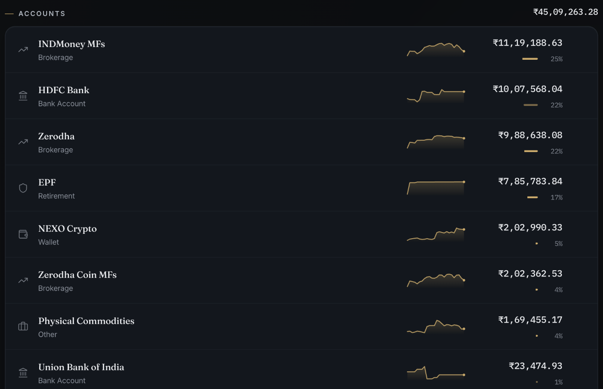

### The market, not just your portfolio
The Nifty 500 split into 26 sectors, sized by market cap and coloured by the move, and where foreign and domestic institutions put their money.

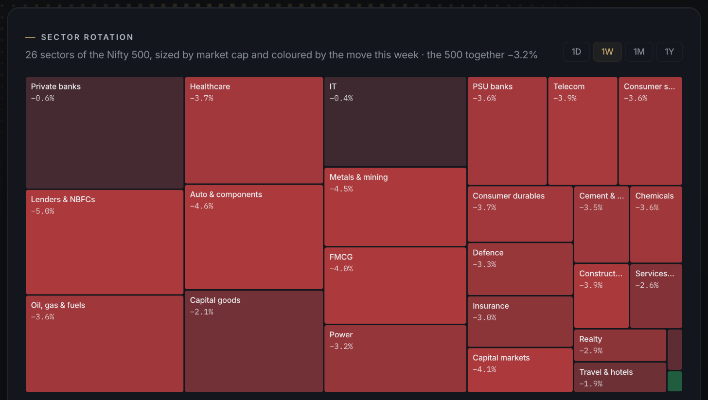

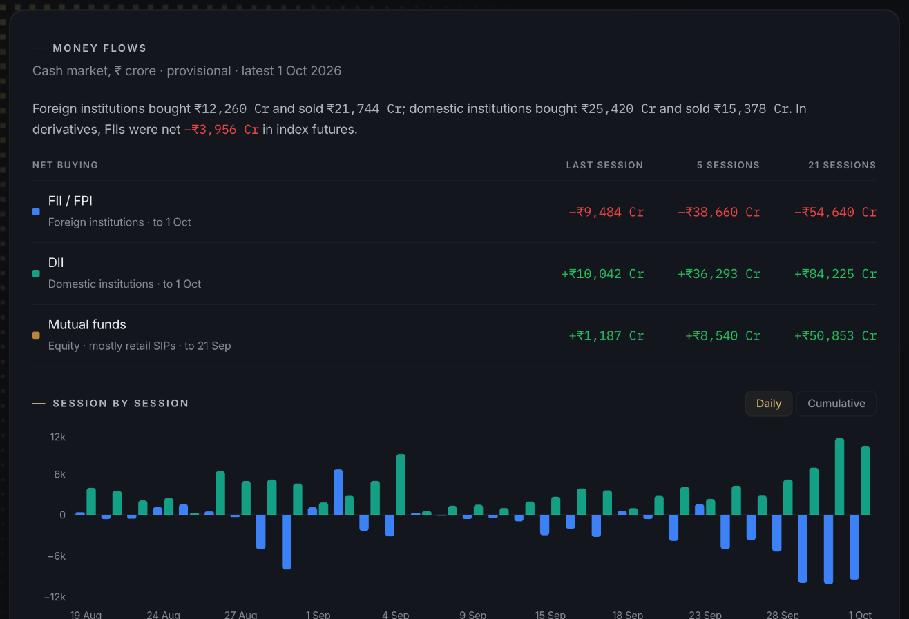

### Every listed company, in full
Twelve years of filings, analysts' targets against today's price, and earnings against expectations.

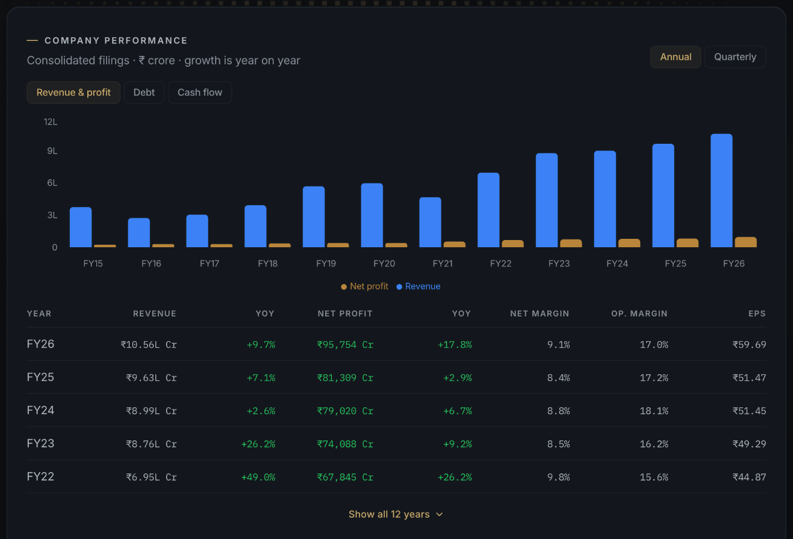

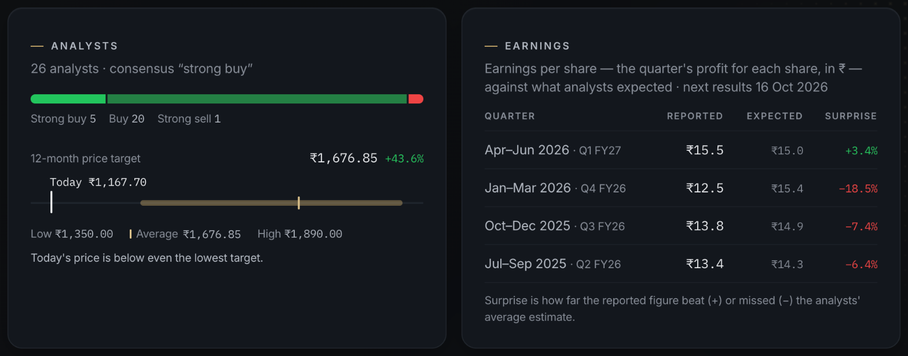

## Features

- **Accounts:** bank, brokerage, retirement, wallet and debt accounts, each split into cash and investments.
- **Transactions:** income, expense, transfer, adjustment, buy and sell, plus recurring schedules (SIPs, rent, salary).
- **Assets:** stocks, ETFs, mutual funds, crypto, gold and silver, bonds, FDs, EPF/NPS, property and more. Foreign assets are converted to rupees at each day's exchange rate.
- **Live prices:** Yahoo Finance for markets, AMFI for Indian mutual funds, domestic gold and silver prices.
- **Net worth over time:** a daily history for the whole picture and for each account.
- **Analytics:** profit and loss, each holding's contribution to your return, comparison against benchmarks (including global indices in rupees), cashflow and category breakdowns.
- **Statement import:** upload a bank, broker or UPI statement (PDF, CSV, HTML or image) and review the transactions before saving. Claude reads statements the built-in parser can't, and categories learn from your history.
- **Markets:** Indian indices, sectors, fund flows, and a page for every NSE company and other assets.

## Getting started

You need Node.js 18+. MongoDB is optional: without it the server starts an in-memory database.

```bash
# Server: http://localhost:5000
cd server
cp .env.example .env
npm install
npm run dev

# Client: http://localhost:5173
cd client
cp .env.example .env
npm install
npm run dev
```

Then open [http://localhost:5173](http://localhost:5173) and create an account. The `.env.example` files list every setting. Statement import by AI needs an Anthropic API key, and Google sign-in needs a Google client ID.

## Stack

React 19, Vite, Tailwind CSS 4 and Recharts on the front end. Node.js, Express and MongoDB on the back end. Hosted on Vercel and Render.

## For developers

- [`structure.md`](structure.md): every component, helper and file, one line each.
- [`CLAUDE.md`](CLAUDE.md): architecture, data model and conventions.
